# AWS 建立 IAM 帳號

從 AWS Root 帳號 開始，先啟用 Taipei Region（ap-east-2 / Asia Pacific Taipei）
接著在 IAM Identity Center 中建立對應的 使用者、群組與權限集
並將 Admin 使用者指派到完全存取權限的 IAM User 與群組
確保日常管理工作可以透過 Admin 帳號完成，同時降低 Root 帳號被誤用或外洩的風險。

在帳號規劃上，至少需要準備兩個不同用途的帳號：

##  【AWS Root 帳號】

僅用於 AWS 帳號初始化、付款資訊、帳號層級設定，以及啟用 IAM Identity Center。
完成初始設定後，不應作為日常管理或開發使用。
必須啟用 MFA，並妥善保管 Root 登入資訊。

##  【IAM User 帳號管理員帳號 Admin User】

透過 IAM Identity Center 建立一個專門用於日常管理的使用者。
將此使用者加入 Administrators 或 Admin 群組。
為該群組配置具備完整管理權限的 Permission Set，AdministratorAccess。
後續 AWS 管理操作應使用此 Admin 帳號登入，而不是直接使用 Root 帳號。

##  ① Root Account 登入與環境準備

1. **Root Account 註冊與登入**：
	- 前往  [AWS Console](https://aws.amazon.com/console/) 註冊 帳號，基本上跟者註冊操作引導即可，完成後以 Root Account 身分登入主控台。（注意：是 AWS 主控台入口，不是一般官網登入口 )

2. **啟用台北區域**：
    
    - 進入帳號設定，將 **Taipei Region (ap-northeast-3)** 切換為 **Enable**。
        
    - 啟用過程大約需要 **5 分鐘**。
    
	- 進入「Account」頁面 -> 尋找 AWS Regions 區塊 -> 在表格中找到 **Asia Pacific (Taipei) / ap-northeast-3** -> 勾選後點擊右側的 **Enable** 按鈕確認 -> 等待 Enabling 變成 Enabled -> 回到 Console 。

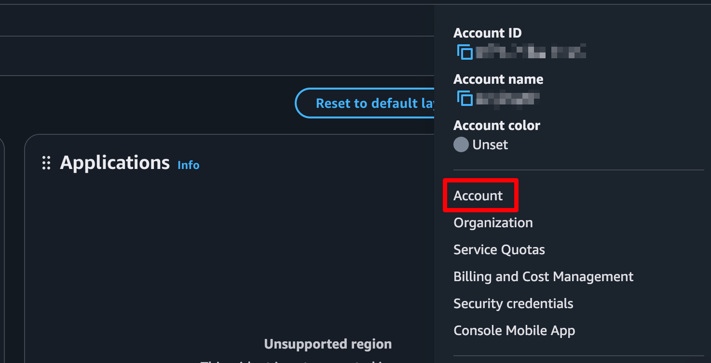

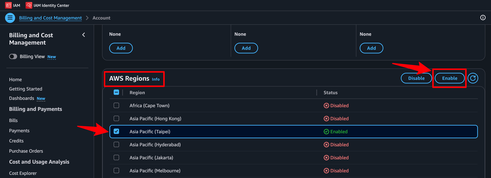

	
3. **確認區域切換成功**：
    
    - 以上處理完畢後，必須檢查主控台**右上角區域 Regions 選單**，確認顯示為 **Taipei** 才是切換成功。

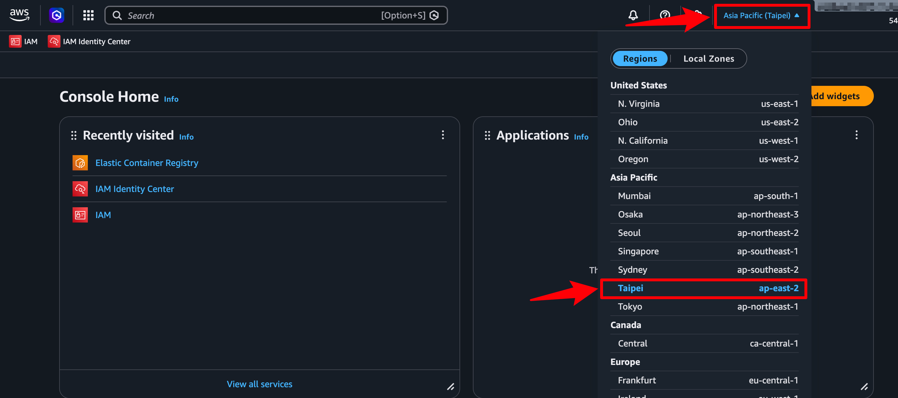

3. **設定 Root 帳號 MFA（多因素驗證）**：
    
    - 為了資安考量，登入時必須綁定 MFA。
        
    - **注意事項**：在輸入驗證碼時，系統通常需要連續輸入兩組不同的動態密碼，**請等待倒數計時並出現第二個驗證碼**後再輸入。

    - 點擊 **Confirm** 完成驗證。

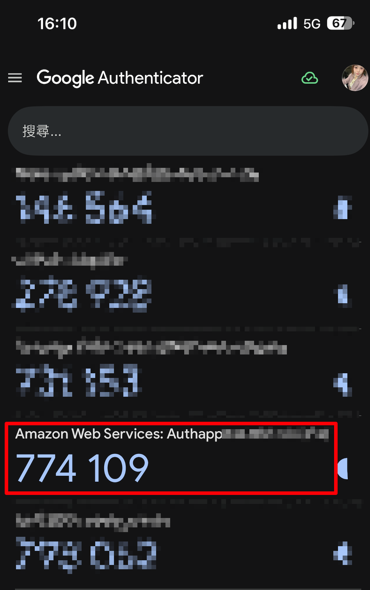
        

## ② 啟用 IAM Identity Center 來建立部署用的 IAM Account User

1. **進入服務**：在搜尋列輸入並進入 **IAM Identity Center** 主控台。
    
2. **確認區域並啟用**：
    
    - 檢查當前區域是否位於 **Taipei Region**。
        
    - 點擊 **Enable**。

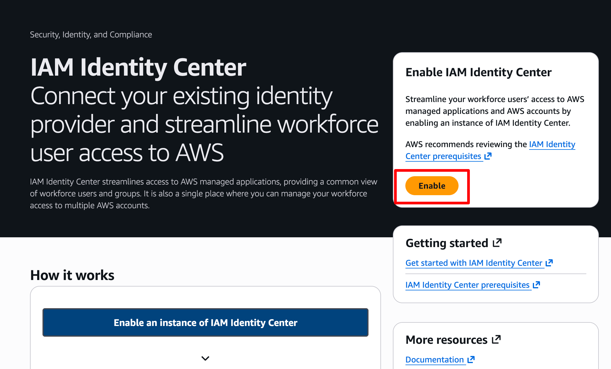
        
3. **組織權限整合**：
    
    - 系統會跳出確認頁面：`Enable IAM Identity Center with AWS Organizations`。
        
    - 確認無誤後，再次點擊 **Enable** 完成組織級別的啟用。
        

## ③ Create group 建立 IAM User 與群組 

1. **Create IAM User**：
    
    - 進入 **Users** 頁面，點擊 **Add user**。
        
    - 輸入 Admin 帳號資訊。**請注意：此處登入用的使用者名稱是自訂名稱（例如 `sunny_admin`），而不是 Email 帳號。**
        
    - 這時候發現缺少 Group ，下一步才建立群組。
        

2. **Create group 建立管理員群組**：
    
    - 進入 IAM Identity Center 左側選單的 **Groups**，點擊 **Create group**。
        
    - 建議命名為 `admin-group`。_（注意：新建立的群組此時尚未配置任何權限，什麼事都不能做）_

	 - 回到 **Create IAM User** 頁面後，再加進剛剛建立的 **Group**

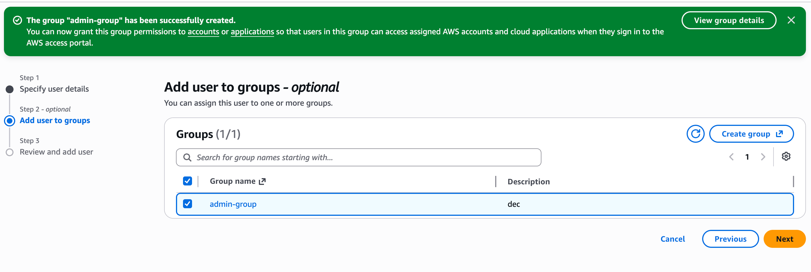

## ④ 配置權限集（Permission Sets）

1. **建立權限集**：
    
    - 進入 **Permission sets** 頁面，點擊 **Create permission set**。

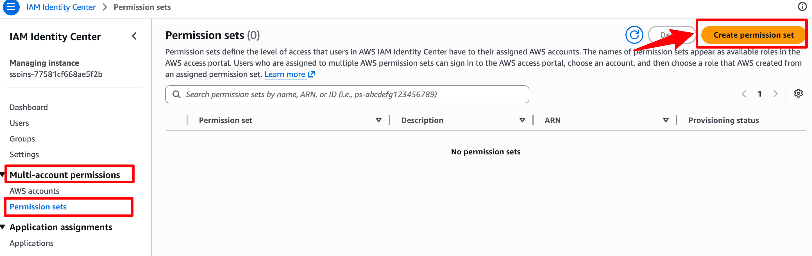

        
2. **選擇預設策略**：
    
    - 選擇 **Predefined permission set**（預設權限集）。
        
    - 勾選 AWS 託管策略：**AdministratorAccess**（此策略提供對所有 AWS 服務與資源的完全存取權限）。

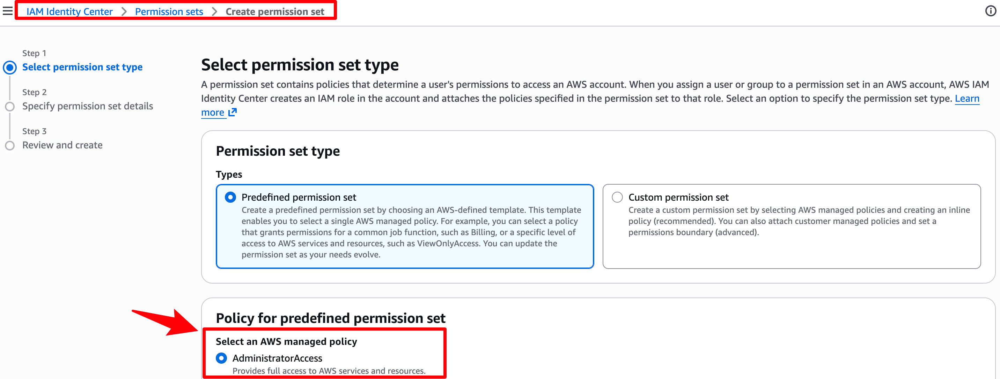
        
3. **調整 Session 持續時間**：
    
    - 在設定設定檔時，尋找 **Session duration** 欄位。
        
    - 將時間**調長至 2 小時（2hr）**，避免操作時頻繁被登出。
        
    - 點擊確認完成權限集建立。

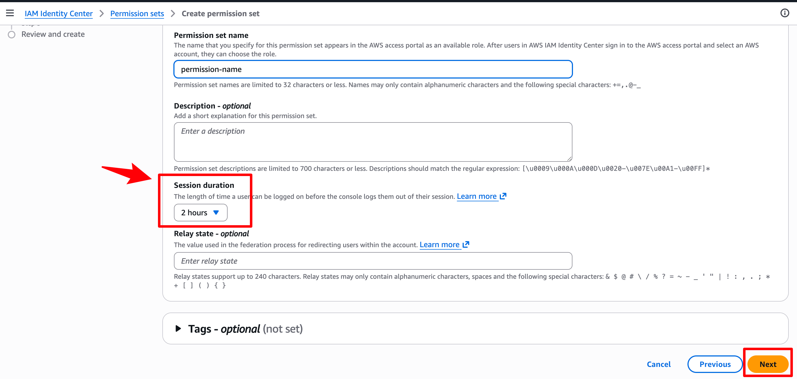

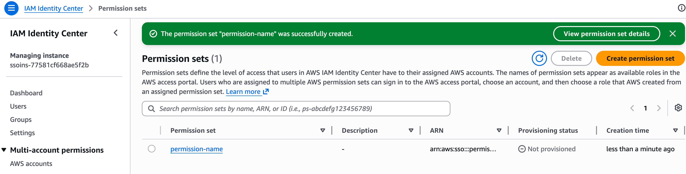

## ⑤ 將權限指派給 AWS 帳號

1. **關聯帳號與權限**：
    
    - 進入 **AWS accounts** 頁面，勾選目標 AWS 帳號。
        
    - 點擊右上角的橘色按鈕：**Assign users or groups**。

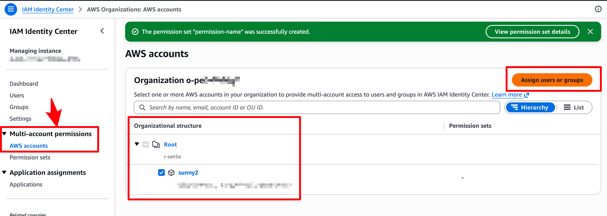
        
2. **指派群組與權限集**：
    
    - 第一步：勾選剛才建立的 **Admin 群組**，點擊 Next。
        
    - 第二步：勾選剛才配置好的 **AdministratorAccess 權限集**，點擊 Next。
        
    - 確認資訊無誤後送出。

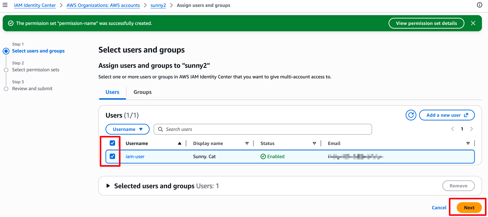

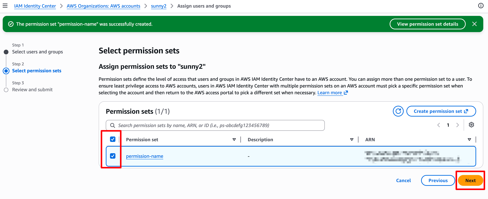

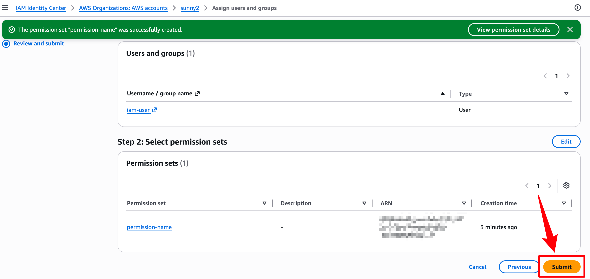

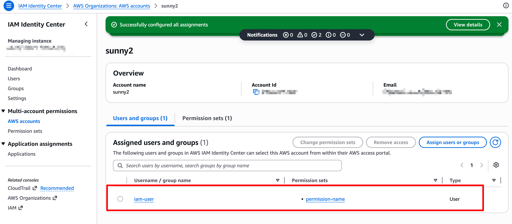

3. **發給 IAM User 驗證信**：
	- 改用 IAM User  信箱重設密碼登入

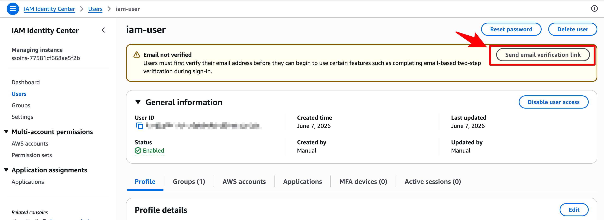

## ⑥ 安全登出與 IAM User 無痕登入驗證
    
1. **開啟無痕視窗**：
    
    - 準備登入不同帳號時，**必須開啟瀏覽器的「無痕視窗」**。如果直接在原視窗開啟，會與原有的 Root 帳號 Session 衝突而導致目前的帳號被登出。
        
2. **使用 Portal URL 登入**：
    
    - 檢查 IAM User 帳號填寫的電子信箱，打開包含 **AWS Access Portal URL** 的重要郵件。
        
    - 複製郵件中的連結（登入口路徑格式：`https://d-OOOOOOOO.awsapps.com/start/`），貼到無痕視窗中打開。(注意：這個網址很重要要記錄下來)
        
	- 使用無痕視窗的登入【IAM User 管理員 Admin 帳號】， 輸入 Username **：
    
    - **請輸入新建立的「使用者名稱（Username，例如 `sunny_admin`）」進行登入，切勿輸入 Email 帳號。**

